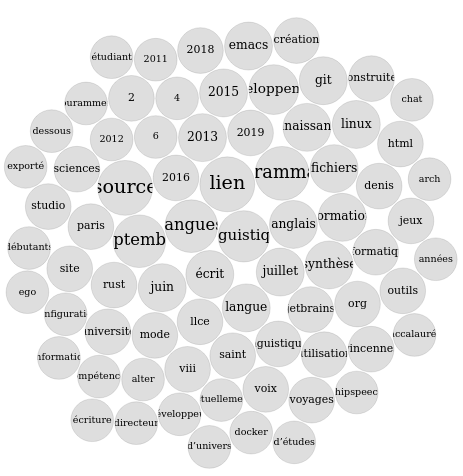

# Lucien Cartier-Tilet

## Liens

Mon CV peut se trouver sur [cette
page](https://samszo.github.io/M1_INFO_20-21/Phundrak/), et son analyse via
Voyant Tools sur
[celle-ci](https://voyant-tools.org/?corpus=a4cb30b6101c610adf8368fb32029059).
Voyant tools est un outil en ligne permettant d’analyser un corpus textuel,
pouvant faire ressortir des tendances dans un document et les relier entre
elles.

## Analyse du texte du CV
### Cirrus
Le premier élément que l’on peut remarquer est le nuage de mots, ou *cirrus*,
dont vous pourrez trouver une copie d’écran ci-dessous.

On remarque que plusieurs mots ressortent rapidement :
- programmation
- développement
- source
- lien
- linguistique
- langues
- septembre

Cela peut s’interpréter comme étant le CV de quelqu’un orienté vers la
programmation et le développement disposant, orienté vers l’open-source et
présent sur le web. On peut y voir également une présence d’aspects orientés
vers la linguistique et le langage. Enfin, il semblerait que plusieurs
événements se soient produits en septembre.

### Liens entre les termes
Nous avons ensuite deux graphes nous montrant comment ces termes et d’autres
sont reliés entre eux, comme on peut le voir ci-dessous.

Alors que le premier ne donne que très peu d’informations (on y voit tout de
même apparaîter des termes tels que *voix*, *synthèse*, *anglais*, *linux* et
*org*), le second est plus intéressant :

Le terme de *programmation* est lié à *l’informatique* (ce n’est pas surprenant)
mais également au terme *septembre*, laissant à penser que ces événements sont
tous plus ou moins liés à l’informatique. On va également considérer que le
terme *développement* est identique à *programmation*, ce qui relie
*programmation* à *source*, lui-même relié à *lien*. On peut donc en conclure
qu’il s’agit effectivement d’un profil de développeur open-source. On voit
apparaître le terme *emacs*, il s’agit sans doute de l’éditeur texte utilisé.
Cependant, rien qui ne soit lié à la linguistique n’apparaît dans ce graphique.

### Tendances
Les tendances affichent l’importance de l’utilisation de certains termes dans la
temporalité du document. Ici, seuls les cinq termes les plus communs sont
représentés. Voici ci-dessous ledit graphique.

On remarque une utilisation relativement régulière du terme *programmation* qui
semble donc être un thème récurrent du CV. *Septembre* apparaît en deux piques,
au début du CV, mais en particulier au milieu, ce qui correspond sans doute à la
partie concernant l’éducation, les années scolaires commençant généralement en
septembre. *Langues* apparaît également à deux moments, avec un pic plus réduit
et un beaucoup plus important. Étant donné qu’il s’agit d’un CV de programmeur,
on peut sans doute en déduire que ces emplacements décrivent les langues
naturelles parlées et de programmation utilisées par l’auteur du CV ; quoique la
linguistique étant un des thèmes les plus importants comme établit ci-dessus, il
est possible que cela ait également un trait à la linguistique. Enfin, les
termes pour *lien* et *source* coïncident presque parfaitement, laissant à
penser qu’il puisse s’agir d’un portefolio de projets open-source avec le lien
partagé par l’auteur.

### Autres remarques
Le document dispose d’une densité de vocabulaire de 0.518, tandis que les
phrases contiennent une moyenne de 28.3 mots, une moyenen assez longue par
rapport à la moyenne en français (15 mots par phrase). Les termes les plus
fréquents de ce corpus sont :
- lien (9)
- source (9)
- programmation (8)
- langues (7)
- septembre (7)
