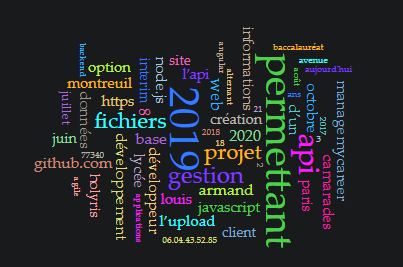
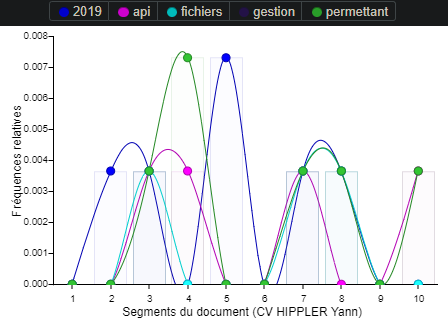

https://samszo.github.io/M1_INFO_20-21/YanHip/cv.html  
https://voyant-tools.org/?corpus=e422e34f8302b814a1d9327415c50298  
 

 Ce graphe représente les 65 mots les plus utilisé dans mon cv. Plus un mot est gros, plus ce dernier est présent dans mon cv. Ainsi on peut voir que j'ai un peu abusé du mot "permettant", par exemple. On peut aussi supposer que lors de l'année 2019 il y a eu pas mal d'activité. De plus on peut determiner qu'il s'agit d'un cv de développeur grâce aux mots comme: "projet", "api", "javascript", "github.com", "developpeur" ou encore "site web"

 

 Sur ce second graphe, on peut voir la fréquence d'utilisation des mots les plus utilisés en fonction de l'avancé dans la lecture du cv. On peut ainsi observer que le mot "permettant" a été utilisé tout au long du cv mais surtout dans la première moitié du cv. Il en est de même pour l'année 2019. Enfin les mots "fichier" et "api" sont utilisés tout au long du cv. 

