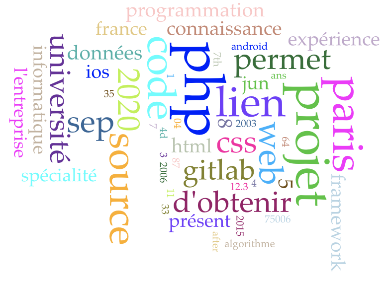
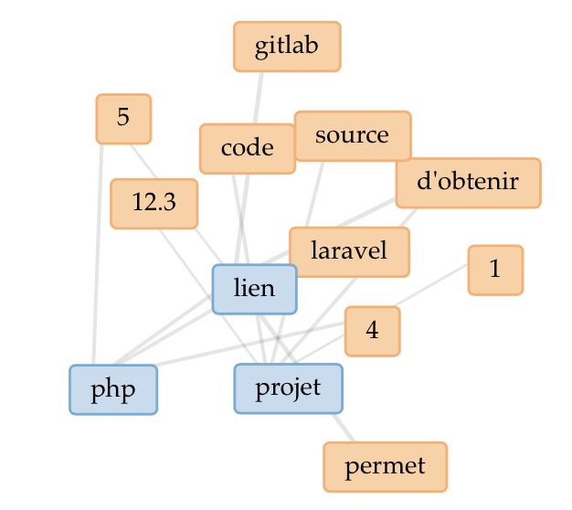
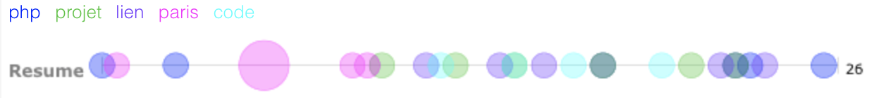
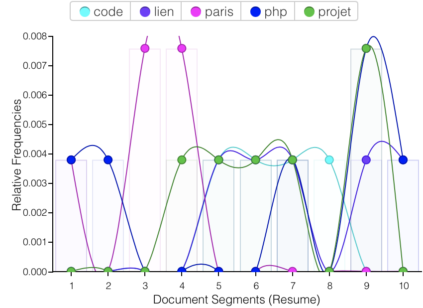

Nga NGUYEN  
Etudiante en Master 1 Informatique
================================
Mon CV [hangngadhp19](https://samszo.github.io/M1_INFO_20-21/hangngadhp19/cv.html)

Une version analysé de mon CV sur : [Voyant Tools corpus](https://voyant-tools.org/?corpus=af84ba16ce2eeecb2d751c17a7394416)

Détails de l'analyse du text-mining de mon CV :
------------------------
### Résumé

This corpus has 1 document with 264 total words and 162 unique word forms. Created now.  

Vocabulary Density: 0.614.  

Average Words Per Sentence: 26.4.  

Most frequent words in the corpus: php (6); projet (6); lien (5); paris (5); code (4)

### Figures graphiques:

**Figure 1: Cirrus**

En analysant mon cv on remarque que les mots les plus utilisés sont : php, projet, css, html.
Cela prouve que mon profil est plutôt orienté vers le développement PHP fullstack.

**Figure 2: Liens**

  
Cette seconde analyse conclut que mon profil favorise le développement de projets PHP utilisant le framework Laravel. Cela montre également que lors de la gestion du code source, j'ai utilisé gitLab. J'ai également utilisé les versions 4 et 5 de PHP dans mes projets.

**Figure 3: Lines de bulles**

D'après ce graphique, je vois ce CV qui couvre le plus la programmation PHP à Paris. Et ce CV est spécialisé dans le développement. Par ailleurs, il existe de nombreux liens vers des projets de référence.

**Figure 4: Tendances**

D'après ce graphique, je vois ce CV qui couvre le plus la programmation PHP à Paris. Et ce CV est spécialisé dans le développement.